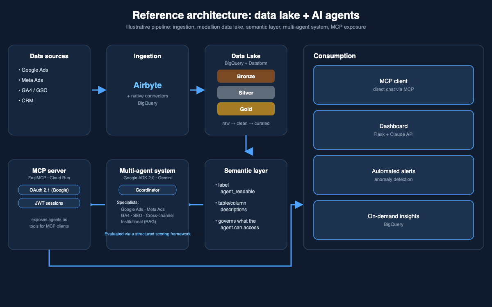

# Marketing Data Lake

A personal project exploring the medallion architecture pattern (Bronze/Silver/Gold), applied to a marketing analytics use case on **Google BigQuery** and **Dataform**, with an eye toward making the Gold layer safely consumable by AI agents. Uses a synthetic dataset, not any employer's or client's real data or pipelines.



*This repo covers ingestion → the medallion lake. The diagram also shows a semantic layer, multi-agent system and MCP server — related patterns explored separately in [multi-agent-analytics](https://github.com/fabricioespel-bit/multi-agent-analytics) and [mcp-server-template](https://github.com/fabricioespel-bit/mcp-server-template), built as independent projects, not as one connected production system.*

## Architecture

```
Raw Sources
    │
    ├── Google Ads          (BigQuery Native Connector)
    ├── Meta Ads            (Airbyte)
    ├── GA4                 (BigQuery Native Export)
    ├── Google Search Console (Airbyte)
    └── CRM                 (Airbyte · PostgreSQL)
         │
         ▼
    ── BRONZE ──────────────────────────────────────────
    Raw ingestion layer. No transformations.
    Partitioned by ingestion date.
    agent_readable: false
         │
         ▼
    ── SILVER ──────────────────────────────────────────
    Cleaned, deduplicated, typed.
    One model per source/entity.
    Incremental with 7-day lookback window.
    agent_readable: true
         │
         ▼
    ── GOLD ────────────────────────────────────────────
    Business-ready aggregations.
    Cross-channel unified performance model.
    Optimized for dashboards and AI agents.
    agent_readable: true
```

## Key Design Decisions

**Incremental models with DELETE + INSERT**
Silver and Gold models use a lookback window to handle late-arriving data without full table scans — sized to cover the kind of delay that shows up in real ad-platform reporting: processing lag plus reprocessing from server-side conversion APIs that can backfill a conversion against a session days after it happened. A window that's too short silently under-counts late conversions; one that's too long makes every incremental run cost close to a full rebuild for no accuracy gain.

**Semantic labels on every table**
Every table carries BigQuery labels (`layer`, `channel`, `agent_readable`, `pipeline`, `domain`) enabling automated governance and agent-safe data access policies.

**Grounding by design**
Gold tables are meant to feed a semantic layer consumed by AI agents. The `agent_readable: true` label is the grounding contract between the data layer and the agent layer — it ties every agent response to a verifiable, governed source instead of the model's parametric memory, which is the core defense against hallucination.

**Connector-aware conventions**
Different patterns for BigQuery Native connectors (Google Ads, GA4) vs Airbyte connectors — cost micros conversion, UNNEST for nested fields, `_airbyte_*` deduplication. Native connectors write directly to BigQuery with Google-managed schema evolution and no extra infrastructure, so they're the default whenever a channel has one. Airbyte only enters the picture for sources without a native BigQuery path — it costs a running connector and its own dedup logic that native connectors don't need.

## Project Structure

```
definitions/
  02_silver/
    gads/         # Google Ads Silver
    ga4/          # GA4 Silver
    meta/         # Meta Ads Silver
    gsc/          # Google Search Console Silver
    crm/          # CRM Silver
  03_gold/
    gads/         # Google Ads Gold
    ga4/          # GA4 Gold
    marketing/    # Unified cross-channel performance
  assertions/
    02_silver/    # Data quality checks per source
    03_gold/      # Cross-channel consistency checks
_templates/
  silver_channel_template.sqlx
  gold_performance_template.sqlx
  assertion_no_duplicates_template.sqlx
```

## Unified Performance Model

The `gld_marketing_performance_daily` table is the core output — a single model that consolidates all paid media channels:

| Column | Description |
|---|---|
| `date` | Event date |
| `source` | Channel (google, meta, tiktok, linkedin, bing) |
| `campaign_name` | Campaign identifier |
| `campaign_objective` | Awareness / Consideration / Conversion |
| `cost_brl` | Media spend in BRL |
| `impressions` | Total impressions |
| `clicks` | Total clicks |
| `ga4_transactions` | Attributed transactions (GA4) |
| `ga4_transaction_value_brl` | Attributed revenue in BRL (GA4) |

## Examples

Illustrative snippets, written for this project with synthetic/generic names — not copied from any employer's or client's codebase.

**Silver model — typed, deduplicated, incremental**

```sqlx
config {
  type: "incremental",
  schema: "silver",
  name: "slv_channel_campaign_daily",
  bigquery: {
    partitionBy: "date",
    labels: { layer: "silver", channel: "channel_name", agent_readable: "true", domain: "marketing" }
  },
  uniqueKey: ["date", "campaign_id"]
}

SELECT
  DATE(event_date) AS date,
  campaign_id,
  campaign_name,
  SAFE_DIVIDE(cost_micros, 1e6) AS cost_brl,   -- BigQuery Native connectors report cost in micros
  impressions,
  clicks
FROM ${ref("bronze_channel_raw")}
WHERE DATE(event_date) >= DATE_SUB(CURRENT_DATE(), INTERVAL 7 DAY)  -- lookback window, see Key Design Decisions
${when(incremental(), `AND date >= (SELECT MAX(date) FROM ${self()})`)}
```

**Assertion — no duplicates on primary key**

```sqlx
config {
  type: "assertion",
  name: "assert_no_duplicate_campaign_days"
}

SELECT date, campaign_id, COUNT(*) AS row_count
FROM ${ref("slv_channel_campaign_daily")}
GROUP BY date, campaign_id
HAVING COUNT(*) > 1
```

An assertion that returns zero rows passes silently. Any row returned fails the Dataform run and blocks deployment — the failure mode is "nothing ships," not "bad data ships with a warning."

**Grounding contract — the label that gates agent access**

```javascript
// definitions/03_gold/marketing/gld_marketing_performance_daily.sqlx (config block)
config {
  type: "table",
  bigquery: {
    labels: {
      layer: "gold",
      agent_readable: "true",
      pipeline: "marketing_unified",
      domain: "marketing"
    }
  }
}
```

`agent_readable` is just a BigQuery label, but it's load-bearing: a semantic layer consuming this data would only list tables carrying `agent_readable: true`. Flip the label to `false` and a table disappears from what any agent can query — no code change in the agent layer required.

## Data Quality

Assertions are mapped to the five data quality dimensions that determine whether a layer is safe to expose to an LLM:

| Dimension | Assertion |
|---|---|
| **Accuracy** | Type checks, range validation on numeric fields |
| **Completeness** | Non-null on required columns |
| **Consistency** | No duplicates on primary key, standardized formats across sources |
| **Relevance** | `agent_readable` label scoped to tables that are actually useful for agent queries |
| **Representativeness** | Date range checks — no future dates, no data older than 2 years, no gaps vs. expected ingestion cadence |

Assertions run automatically on every Dataform execution and block deployment on failure — bad data never reaches a layer an agent can query.

## Stack

- **Transformation:** Dataform (SQLX)
- **Warehouse:** Google BigQuery
- **Ingestion:** BigQuery Native Connectors · Airbyte
- **Orchestration:** Dataform Schedules · Cloud Workflows
- **Language:** SQL · JavaScript (Dataform config)

## Adding a New Channel

1. Confirm raw dataset exists in BigQuery
2. Add vars to `workflow_settings.yaml`
3. Create Silver models in `definitions/02_silver/<channel>/`
4. Create Gold models in `definitions/03_gold/<channel>/`
5. Add assertions in `definitions/assertions/`
6. Add `UNION ALL` to `gld_marketing_performance_daily`
7. Set BigQuery labels on new datasets

## Related Projects

Independent projects exploring adjacent patterns, not components of one deployed system:

- [multi-agent-analytics](https://github.com/fabricioespel-bit/multi-agent-analytics) — AI agents conversing over a data lake shaped like this one
- [marketing-dashboard](https://github.com/fabricioespel-bit/marketing-dashboard) — a performance dashboard built on a similar Gold-layer model
